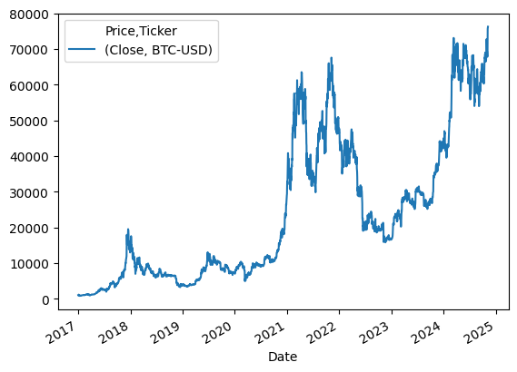
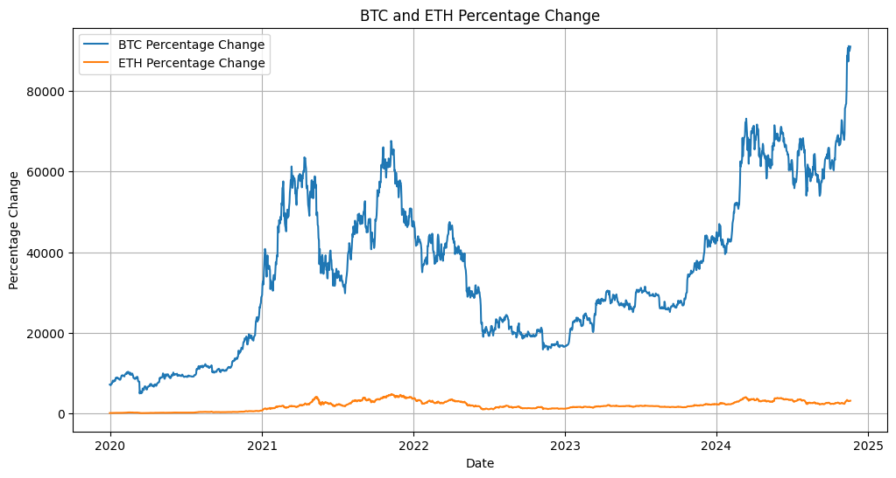
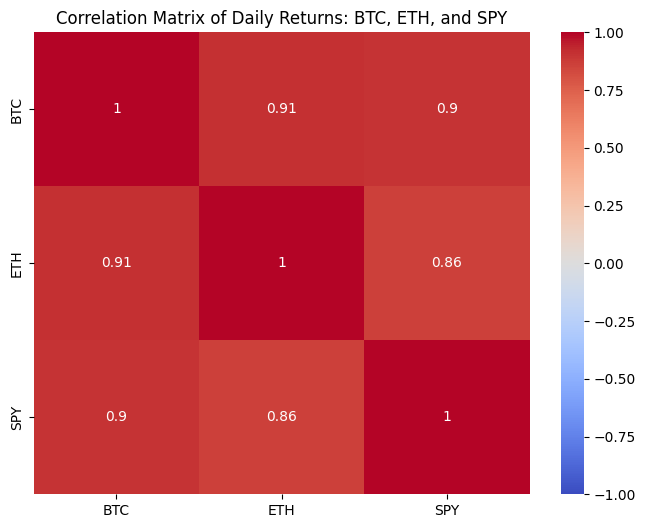
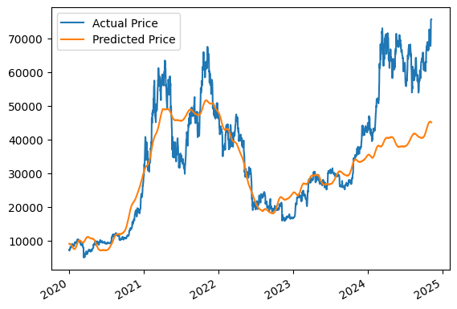
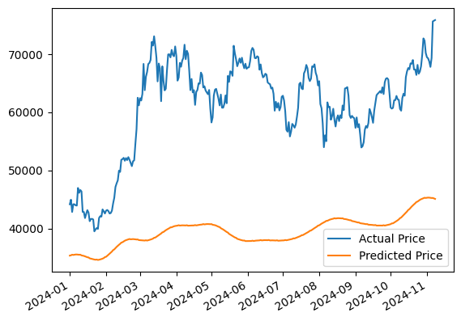
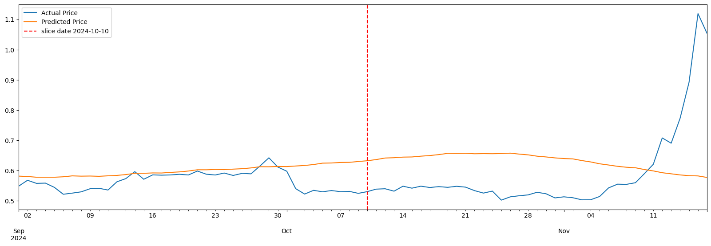
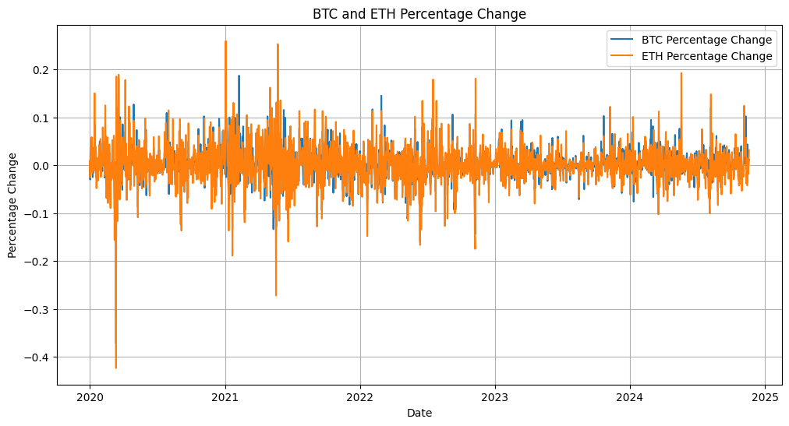
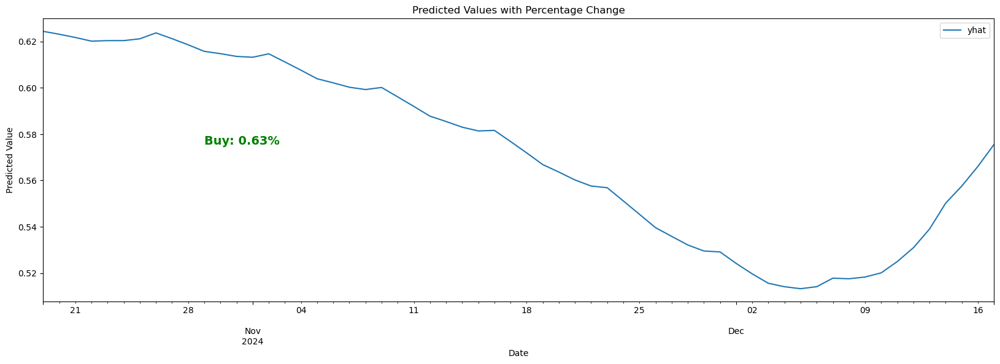
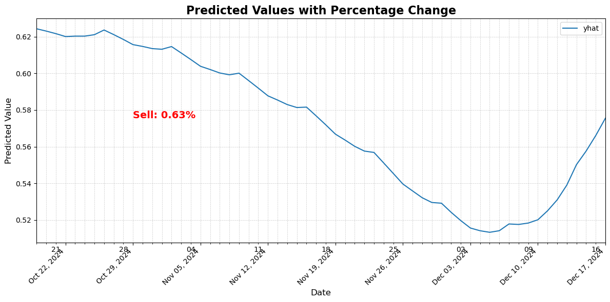

# Money-Printer

In the highly volatile cryptocurrency market, understanding trends and making accurate predictions can empower investors and analysts to make better decisions. This project leverages **correlation analysis** and the **Prophet model** to provide insights into market behavior and forecast cryptocurrency trends effectively.

---

## Table of Contents

- [Money-Printer](#money-printer)
  - [Business Understanding](#business-understanding)
  - [Data Understanding](#data-understanding)
  - [Data Analysis](#data-analysis)
    - [Correlation Analysis](#correlation-analysis)
  - [Predictive Modeling with Prophet](#predictive-modeling-with-prophet)
    - [Data Segmentation](#data-segmentation)
    - [Model Testing](#model-testing)
    - [Future Predictions](#future-predictions)
  - [Visualization](#visualization)
  - [Conclusion and Future Work](#conclusion-and-future-work)
  - [Project Presentation](#project-presentation)
    - [Team Members](#team-members)
    - [Project Overview](#project-overview)
    - [Goals and Questions Addressed](#goals-and-questions-addressed)
    - [Approach Taken to Achieve Goals](#approach-taken-to-achieve-goals)
    - [Results and Conclusions](#results-and-conclusions)
  - [Repository Structure](#repository-structure)

---

## Business Understanding

The cryptocurrency market's high volatility and complex interrelationships between coins present a challenge for traders and investors. However, by identifying correlations and applying predictive modeling with Prophet, it’s possible to gain insights into:

- **Market dynamics**: Understanding how cryptocurrencies influence each other.
- **Trend prediction**: Estimating future price movements based on historical data.
- **Risk management**: Identifying which assets move together or diverge to inform diversification strategies.

The **Money-Printer** application addresses these needs by equipping users with a tool to analyze cryptocurrency trends and correlations while generating actionable insights.

---

## Data Understanding

**Reliable data sources** are crucial for this project. The dataset includes historical cryptocurrency data such as:

- **Price**: Open, high, low, and close prices for selected coins.
- **Volume**: The amount of cryptocurrency traded over specific intervals.
- **Market Capitalization**: The total market value of a cryptocurrency.

### Data Sources:

1. **[CoinMarketCap](https://coinmarketcap.com/)**: A leading cryptocurrency data aggregator.
2. **[CoinGecko](https://www.coingecko.com/)**: Provides historical and real-time market data.

### Data Cleaning and Preprocessing:

To ensure accuracy, the data undergoes rigorous preprocessing:

- Removal of duplicates and null values.
- Conversion of timestamp data to datetime objects.
- Normalization for consistent analysis (e.g., scaling prices for comparison).

---

## Data Analysis

### Correlation Analysis

Correlation analysis identifies relationships between cryptocurrencies to understand how their prices move together.

Key steps:

1. **Calculate Correlation Coefficients**: 
   - Pearson correlation for linear relationships.
   - Spearman correlation for ranking-based relationships.

2. **Lagged Correlations**:
   - Determine if price movements in one cryptocurrency lead movements in another.

3. **Visualization**:
   - Use heatmaps and interactive graphs to make relationships clear.

---

## Predictive Modeling with Prophet

### Data Segmentation

To ensure the robustness of the Prophet model:

- **Split Data**: Divide historical data into training and validation sets.
- **Train Model**: Train the Prophet model using the training set.
- **Validate**: Test predictions on unseen data from the validation set.

### Model Testing

The **Prophet model**, a time-series forecasting tool, was utilized for its ability to handle seasonality and trends effectively. It was evaluated based on:

- **Prediction Accuracy**: Comparing forecasted values with actual values.
- **Visualization**: Displaying predicted vs actual trends to verify performance.

### Future Predictions

Using Prophet, predictions were generated for selected cryptocurrencies with:

- **Confidence Intervals**: Representing uncertainty in the forecasts.
- **Trend Analysis**: Highlighting potential future movements in the market.

---

## Visualization

Interactive dashboards and charts help users explore:

- **Correlation heatmaps** to identify relationships.
- **Historical trends** with line graphs and candlestick charts.
- **Predicted vs actual prices** for validation.
- **Prediction intervals** for confidence visualization.
- **User controls** for customized inputs (e.g., date range, coin selection).

---

## Conclusion and Future Work

The Money-Printer project combines correlation analysis and predictive modeling using Prophet to provide insights into cryptocurrency markets. While the current application offers valuable tools, future enhancements include:

1. **Advanced models**: Exploring techniques like LSTM or transformer models to improve prediction accuracy.
2. **Real-time updates**: Providing dynamic, up-to-date analyses.
3. **Broader asset coverage**: Expanding analysis to include more coins and indices.
4. **User-friendly interfaces**: Enhanced input options and visualizations.

---

## Project Presentation

### Team Members

- **Avineet Sharma**
- **Omar Alsadoon**
- **Vinayak Grover**
- **Natasha Anghelescu**
- **Daniel Levy**

### Project Overview

This project uses **data-driven tools** to analyze cryptocurrency trends through:

- Predictive modeling with Prophet for price forecasting.
- Correlation analysis for asset relationship insights.

### Goals and Questions Addressed

1. **Can cryptocurrency prices be predicted using historical data?**
2. **Do cryptocurrency prices correlate with each other?**

### Approach Taken to Achieve Goals

#### Price Prediction Dashboard:

- Prophet analysis for price trends.
- Interactive inputs for custom analysis.
- Visualization of buy/sell signals.

#### Correlation Analysis:

- Explored relationships between selected assets.
- Interactive graphs and heatmaps to highlight significant findings.

### Results and Conclusions

---

#### Price Prediction:

- The Prophet model demonstrated strong short-term trend prediction accuracy.
- Visualization tools provided actionable insights.

#### Correlation Analysis:

- Revealed significant positive correlations (e.g., BTC and ETH).
- Identified anomalies in correlations due to data processing issues, later resolved.

---

## Repository Structure
├── price-predictor/              
  └── plots/
  └── crypto_price_predictor_visualizer.ipynb

├── correlation-finder/        
  └── Corr_Media/
  └── crypto_correlation_finder.ipynb

├── README.md

---

For additional inquiries or further collaboration, contact the project team.